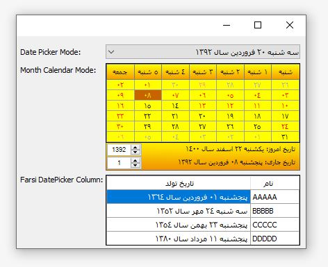

# Farsi-Calendar C# .Net Framework 4 (Persian Calendar in .Net 4.8)
C# Windows form beautiful persian calendar
*خبر جدید: یک تقویم فارسی دیگر برای ویندوز فرم نوشتم که بسیار زیباتر است. اگر کسی مایل به توسعه و بهبودش بود به تلگرامم پیام بدهد.


# AmirCalendar
این پروژه را در نرم افزار مطب اکسیر استفاده کردم. اما با توجه به اینکه میدیدم علی رغم به وجود آمدن تکنولوژی ها و آبجکت های جدید اما هنوز نقص کامپوننت در ویندوز فرم و تقویم فارسی وجود داره
تصمیم گرفتم این پروژه رو گیت هاب کنم. و تغییرات جدید که سالهای اخیر اضافه شده مثل تعطیلات جدید عید فطر یا چندین واقعه جدید را به روز کنم و هم وطنان بتوانند استفاده نمایند.
پیشنهاد به مشاهده [تلاش نت](https://talashnet.com/) و [نرم افزار مطب اکسیر](https://exirmatab.com)



**همچنین جا داره از طراح اصلی این کامپوننت تشکر لازم را به عمل آورم.**


# Description
1. همونطوری که گفتم، این کامپونت قابلیت اینو داره که مناسبتهای تقویم قمری و شمسی رو نشون بده و تعطیلات رو هم از روزهای غیر تعطیل متمایز کنه. مثلا با بردن موس روی تاریخ 1392/01/05 مناسبتهای این روز تو قسمت پایین این کامپوننت نمایش داده میشه
 در مورد تاریخ شمسی هیچ مشکلی وجود نداشت. شما هر تاریخ میلادی رو بدون دردسر و از طریق کلاس PersianCalendar میتونید تبدیل به تاریخ شمسی کنید.
اما در مورد تقویم قمری و کلاس HijriCalendar به این راحتی ها نیست. یعنی چی؟
یعنی اینکه ممکنه شما تاریخ میلادی رو تبدیل کنید به تاریخ قمری ولی وقتی نتیجه رو با تقویم مقایسه میکنید نتیجه 1 تا نهایتا 2 روز با اون چیزی که از طریق کلاس HijriCalendar به دست اومده ممکنه متفاوت باشه!! چرا اینجوریه؟
عرب هستن دیگه. حساب کتاب نداره که کاراشون. میگن آقا ما چیزی رو قبول نداریم الا اینکه اون چیز رو با چشم ببینیم. مثلا میگن 
```

مطابق حکم شرعی اگر هلال ماه در شامگاه بیست‌ونهم ماه رؤیت شود، آن ماه به پایان رسیده و فردا اول ماه بعد است؛
ولی اگر هلال ماه در شامگاه روز بیست‌ونهم رویت نشد، ماه ۳۰ روزه می‌شود

```

و اینجوری میشه که خیلی ها میان تاپیک میزنن که آقا چرا تو این نوع تبدیل کلاس HijriCalendar یا vs باگ داره.
باگی نیست. اعراب محترم 2 نوع تقویم دارن. تقویم هلالی و تقویم قراردادی. (تو همه کاراشون ار تقویم هلالی استفاده میکنن) تقویم قراردادی قمری مثل تقویم میلادی یا شمسی یه قاعده ثابت داره و از طریق همون کلاس HijriCalendar به دست میاد. ولی برای رفع خطای 1 یا 2 روزه تقویم هلالی، تو کلاس HijriCalendar یه پراپرتی
قرار دادن به اسم HijriAdjustment که تو رنج -2 تا 2 مقدار میگیره.
بعضی ها گفتن ما این مقدار رو هم set میکنیم ولی بازم تو ماه یا ماههای بعد مناسبتهای تقویم قمری با تقویم شمسی جور در نمیاد. موضوع اینجاس که هر ماه قمری HijriAdjustment مخصوص به خودش رو داره. شما نمیتونید از یک مقدار HijriAdjustment برای کل سال قمری استفاده کنید. مثلا ممکنه برای محرم این مقدار -1 باشه و برای صفر -2


 مشکل تو تاریخ قمری فقط گزینه 1 نیست. مشکل بعدی اینه که فرضا شما برای سال 1392 شمسی میاید و HijriAdjustment مورد نیاز رو واسه ماههای قمری تو این سال ست میکنید. با تموم شدن سال 1392 دیگه این HijriAdjustment ها برای سال 93 و سالهای بعدی (یا قبلی، چون تو DatePicker مطمئنا قابلیت انتخاب سال هم وجود داره) اعتبار نداره و مجددا باید مقادیر HijriAdjustment رو از روی تقویم برای سال جدید پیدا کنید و ست کنید. این همون کاریه که اکثر نرم افزارهایی که با تقویم قمری کار میکنن انجام میدن. یعنی آخر سال میان یه فایل اصلاح کننده HijriAdjustment برای سال جدید میدن به یوزرها. این فایل میتونه یه txt یا xml باشه و کاری که یوزر باید انجام بده جایگزین کردن این فایل با فایل قبلی هستش. من هم تو ین کامپوننت از یه فایل xml به اسم
HijriCalendarPatch.xml استفاده کردم که مناسبتهای تقویم قمری رو برای سال شمسی مورد نظر ست میکنه. مشخصه که اگه سال دیگه ای جز سالی که HijriAdjustment برای اون ست شده، توسط DataPicker مشاهده بشه، مناسبتهای سال قمری یکی دو روز اینور اونور میشه نسبت به تقویم اصلی.
کافیه واسه سال شمسی جدید این فایل رو با notepad باز کنید و مقادیر رو برای هر ماه اصلاح کنید. دقت کنید که فرمت باید به شکل زیر باشه و فقط مقادیر اصلاح بشن. در غیر این صورت مناسبتهای تقویم قمری اصلا درنظر گرفته نمیشن.

```
<?xml version="1.0" encoding="utf-8" ?>
<months>
  <month key="1" value="-1" />       <!--محرم-->
  <month key="2" value="0" />        <!--صفر-->
  <month key="3" value="-1" />        <!--ربیع الاول-->
  <month key="4" value="0" />        <!--ربیع الثانی-->
  <month key="5" value="-1" />       <!--جمادی الاول-->
  <month key="6" value="-1" />       <!--جمادی الثانی-->
  <month key="7" value="-2" />       <!--رجب-->
  <month key="8" value="-1" />       <!--شعبان-->
  <month key="9" value="-2" />       <!--رمضان-->
  <month key="10" value="-2" />      <!--شوال-->
  <month key="11" value="-2" />      <!--ذیقعده-->
  <month key="12" value="-2" />      <!--ذالحجه-->
</months>
```

3. اما نحوه ست کردن value ها تو فایل HijriCalendarPatch.xml برای ماههای قمری و برای ست شدن مناسبتها با سال شمسی مورد نظر
مواد مورد نیاز: یک عدد تقویم سال شمسی مورد نظر (مثلا تقویم سال 1392 که تو فایل ضمیمه قرار دادم)
و 5 الی 10 دقیقه وقت و حوصله. و اما نحوه کار
تو ماه فروردین سال 1392 (اولین ماه تقویم شمسی) از روی تقویمی که دارید، یکی از مناسبتهای مربوط به تاریخ قمری رو پیدا کنید (البته ممکنه مثلا از نیمه فروردین ماه، ماه قمری تغییر کنه که به این نکته هم توجه داشته باشید) بعد ببینید معادل تاریخ شمسی اون مناسبت چه تاریخی هستش (مثلا 13 جمادی الاول که شهادت حضرت فاطمه (س) به روایتی هستش، میشه معادل 5 فروردین 1392 (اگه بدون HijriAdjustment این تاریخ رو به دست بیارید میشه 4 فروردین). خوب چون مناسبت متعلق یه ماه جمادی الاول هستش (ماه 5 از تقویم قمری) پس یعنی میخوایم مقدار value رو برای خط زیر تو فایل HijriCalendarPatch.xml به دست بیاریم (فرض میکنیم دیفالت همه value ها تو فایل HijriCalendarPatch.xml برابر 0 هستش)

```
<month key="5" value="-1" />       <!--جمادی الاول-->
```
یه کامپوننت DatePicker رو فرم قرار میدیم و برنامه رو اجرا میکنیم. DatePicker رو باز میکنیم و موس رو میبریم رو 5 فروردین 1392. نگاه میکنیم اگه پایین کامپوننت مناسبت مورد نظر ظاهر شد که یعنی مناسبتهای ماه جمادی الاول برای سال شمسی 1392 با همون HijriAdjustment دیفالت (یعنی 0) ست میشه و نیازی به تغییر value برای این ماه نیست. ولی اگه مناسبت مورد نظر ظاهر نشد، موس رو تو رنج 1392/01/03 الی 1392/01/07 حرکت میدیم تا اون مناسبت رو پیدا کنیم (2 روز کمتر یا بیشتر) مثلا اگه مناسبت افتاده بود رو تاریخ 1392/01/04 این یعنی اینکه تاریخ قمری برای ماه جمادی الاول تو سال 1392 باید 1 روز بره جلوترتا بیافته رو 5 فروردین. برای جلو بردنش هم از مقدار -1 استفاده میکنیم (1- یک رو جلو میره -2 دو رو جلو میره. 0 بدون تغییر و 1 و 2 هم به ترتیب 1و2 روز به عقب میره).
برای باقی ماههای قمری هم به همن صورت عمل میکنیم.
فایل HijriCalendarPatch.xml که همراه پروژه هستش و محتواش رو هم بالا قرار دادم، برای سال 92 تنظیم شده.
این فایل باید کنار exe برنامه باشه

4. برنامه همه مناسبتهای تقویم شمسی و قمری رو از فایل DayEvents.xml که تو Resources این کامپوننت قرار گرفته میخونه. قالب این فایل به این صورت هستش

```
<?xml version="1.0" encoding="utf-8" ?>
<calendars>
  <calendar name="Persian">
    <day month="1" day="1" isHoliday="1" event="روز اول عید نوروز" />
    <day month="1" day="2" isHoliday="1" event="روز دوم عید نوروز - آغاز عملیات فتح المبین" />
    <day month="1" day="2" isHoliday="1" event="هجوم ماموران ستم شاهی به مدرسه فیضیه قم" />
  </calendar>
  <calendar name="Hijri">
    <day month="1" day="1" isHoliday="0" event="آغاز سال جدید هجری قمری" />
    <day month="1" day="9" isHoliday="1" event="تاسوعای حسینی" />
    <day month="1" day="10" isHoliday="1" event="عاشورای حسینی" />
    <day month="1" day="12" isHoliday="0" event="شهادت حضرت امام زین العابدین علیه السلام" />
    <day month="1" day="25" isHoliday="0" event="شهادت حضرت امام زین العابدین علیه السلام به روایتی" />
    <day month="2" day="7" isHoliday="0" event="ولادت حضرت امام موسی کاظم علیه السلام" />
  </calendar>
</calendars>
```
البته این واسه نمونه هستش و فایل اصلی اکثر مناسبتها توش قرار داره. اگه خواستید مناسبتهای دیگه رو بهش اضافه کنید، دقت کنید که مناسبتهای تقویم شمسی تو بخش اول و مناسبتهای تقویم قمری تو بخش دوم درج بشه. تو بخش اول منظور از month ماه شمسی و تو بخش دوم ماه قمری هستش.

5. کلاس FarsiDateHelper هم شامل یه سری توابع کمکی هست که میتونید از اونها هم تو پروژه خودتون استفاده کنید.
